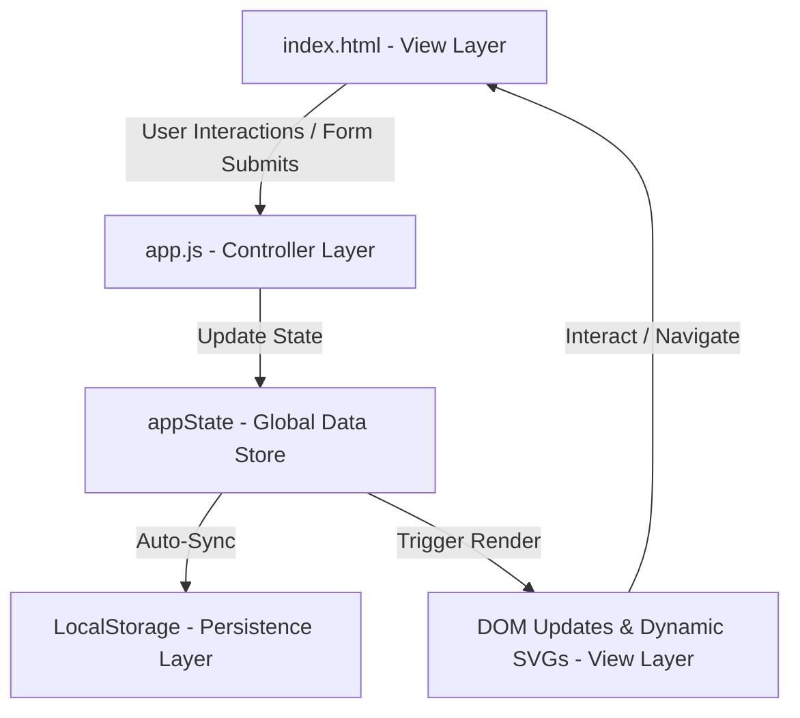
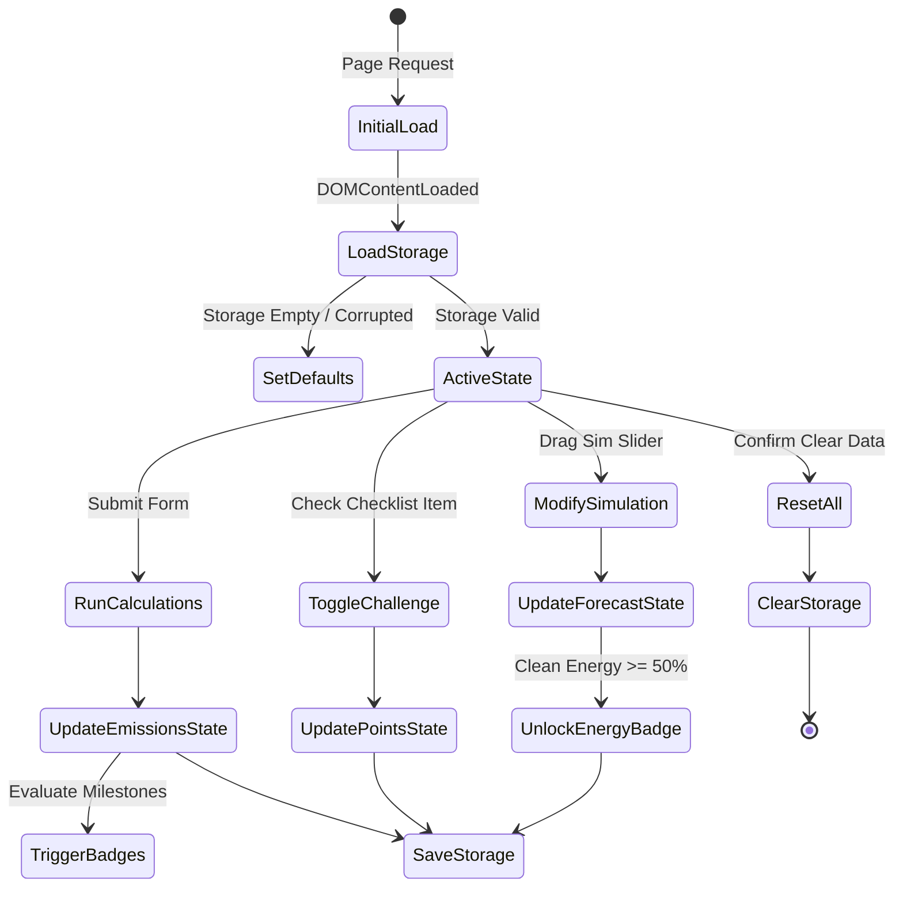

# ARCHITECTURE.md — CarbonTrack AI System Design

This document describes the architectural layout, state machine, data flows, and rendering lifecycle of **CarbonTrack AI**.

---

## 1. System Overview

CarbonTrack AI is built as a **Single Page Application (SPA)** utilizing a local-first, decoupled architecture. It avoids complex bundlers or frameworks to maintain a repository size under **300 KB** while achieving immediate load speeds and high runtime efficiency.

---

## 2. Component Layout

The application codebase is structured into five distinct operational domains:

1.  **State Layer (`appState`):** In-memory JavaScript object containing properties for calculator logs, points, streaks, badges, simulation configurations, and chat history.
2.  **Calculator Engine:** Calculates annual metric tons of CO₂ equivalent values using EPA and IPCC coefficients.
3.  **Simulation Engine:** Calculates projected offsets based on Clean Energy, EV, diet, and shopping adjusters.
4.  **Chatbot Engine (EcoBuddy):** Runs locally in the browser to analyze carbon categories and generate sustainability recommendations.
5.  **Rendering Engine:** Handles DOM manipulation, CSS tab switching, and drawing SVG donut/trend charts.

---

## 3. State Flow & Data Lifecycle

### 3.1 State Transitions
The system follows a strict unidirectional data flow:

### 3.2 Storage Layer
*   **Mechanism:** Standard browser `LocalStorage` API.
*   **Key:** `carbontrack_ai_state`.
*   **Serialization:** Data is serialized to a JSON string on save and parsed on load.
*   **Validation:** A schema checker validates loaded data structures and falls back to default values in case of corruption.

---

## 4. Rendering Pipeline & SVG Charts

Because CarbonTrack AI does not use heavy rendering frameworks (e.g. React) or graphing libraries, it employs a custom rendering pipeline:

1.  **Master View Trigger (`renderAllViews`):** Invoked upon state updates. Triggers rendering for active components.
2.  **Dynamic SVG Donut Chart:**
    *   Clears existing paths in the `<svg id="breakdown-pie-chart">` element.
    *   Loops through calculator metrics (Transport, Energy, Food, Shopping) and maps their percentages to SVG arcs.
    *   Appends dynamic `<path>` elements with HSL stroke/fill styling and registers event listeners for interactive hover tooltips.
3.  **Dynamic SVG Line Chart:**
    *   Plots coordinates dynamically based on the calculation history array.
    *   Calculates responsive width/height ratios, sets grid lines, and draws the line path.
    *   Adds interactive hover nodes to display historical points.
4.  **Accessibility Live Announcements:**
    *   Updates the `#sr-announcer` Polite live region during rendering updates, enabling screen reader announcements for important state transitions.
