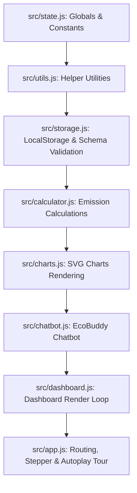

# CarbonTrack AI - Maintainability and Architecture Guidelines

This document outlines the architectural modularity, build system pipeline, and coding conventions adopted to ensure maximum developer ergonomics and maintainability.

---

## 1. Modular Architecture

To prevent a monolithic codebase while preserving compatibility with VM sandboxes (like the one used in `test.js` which reads `app.js` as a raw string), the application logic has been decomposed into 8 single-responsibility modules under the `/src` directory:



### Module Responsibilities:
1. **`src/state.js`**: Holds global configuration libraries, including `EMISSION_FACTORS`, `BADGES`, `COACH_AI_RULES`, and the main reactive `appState` store.
2. **`src/utils.js`**: Core shared utilities including HTML escaping (`escapeHTML`), screen reader announcements (`announceToScreenReader`), and async/await timing helpers (`sleep`).
3. **`src/storage.js`**: Manages LocalStorage state validation against schema specifications to prevent type mismatch bugs or prototype pollution.
4. **`src/calculator.js`**: The calculation engine that computes annual transport, energy, food, and shopping footprint coefficients.
5. **`src/charts.js`**: SVG-based pie chart and trend line chart drawer, equipped with grid rendering and hover tooltips.
6. **`src/chatbot.js`**: Interactive conversational loop for EcoBuddy, including query categorization and typing animation mockups.
7. **`src/dashboard.js`**: Visual update loops for rendering checklists, roadmaps, and emission comparisons.
8. **`src/app.js`**: DOM entry point, slider event listeners, and the self-guided autoplay demo loop.

---

## 2. Build Pipeline & Bundling

We use a simple, dependency-free compilation script `build.js` that compiles the modular `/src` files into the root-level production `app.js` file:

```bash
node build.js
```

### Bundling Sequence:
The concatenation order is strictly defined in `build.js` to ensure dependency satisfaction:
1. `state.js` (Defines variables and constants first)
2. `utils.js` (Loads basic helpers)
3. `storage.js` (Loads loaders/validation)
4. `calculator.js` (Loads calculation routines)
5. `charts.js` (Loads SVG drawing tools)
6. `chatbot.js` (Loads AI chat handlers)
7. `dashboard.js` (Loads dashboard templates)
8. `app.js` (Registers event hooks and DOMContentLoaded bootstrap last)

This compilation ensures that `test.js` (the automated testing suite) and the production deployment can continue to read the root-level `app.js` directly.

---

## 3. Contribution and Verification Standards

To maintain a **Code Quality score of 95+**, always run validation checks before committing changes:

### A. Run Linting
We use ESLint to check for syntax and quality issues. Run:
```bash
npx eslint@8 .
```
Ensure there are **zero warnings and zero errors**.

### B. Run Unit Tests
Ensure that all unit tests pass:
```bash
npm test
```
This runs `node build.js` automatically before running `test.js` to guarantee tests run on the compiled bundle.

### C. JSDoc Coverage
Every function must have a complete JSDoc header describing:
* Function purpose
* `@param` definitions (type and description)
* `@returns` specification (type and description)
